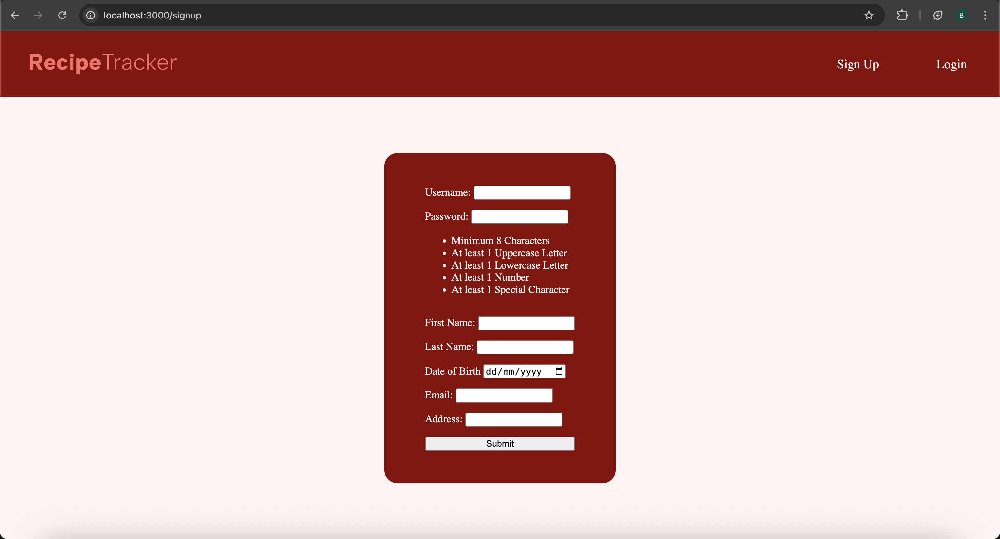
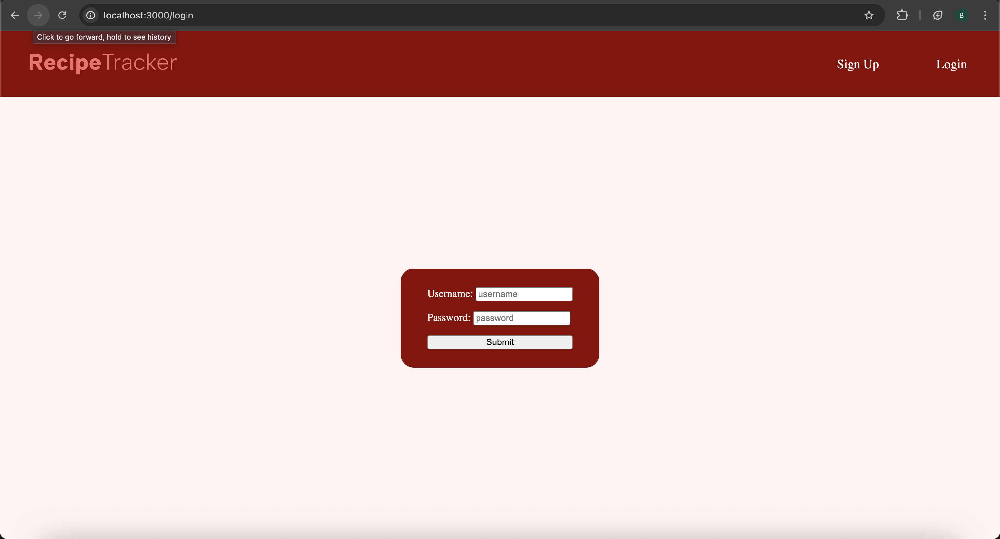
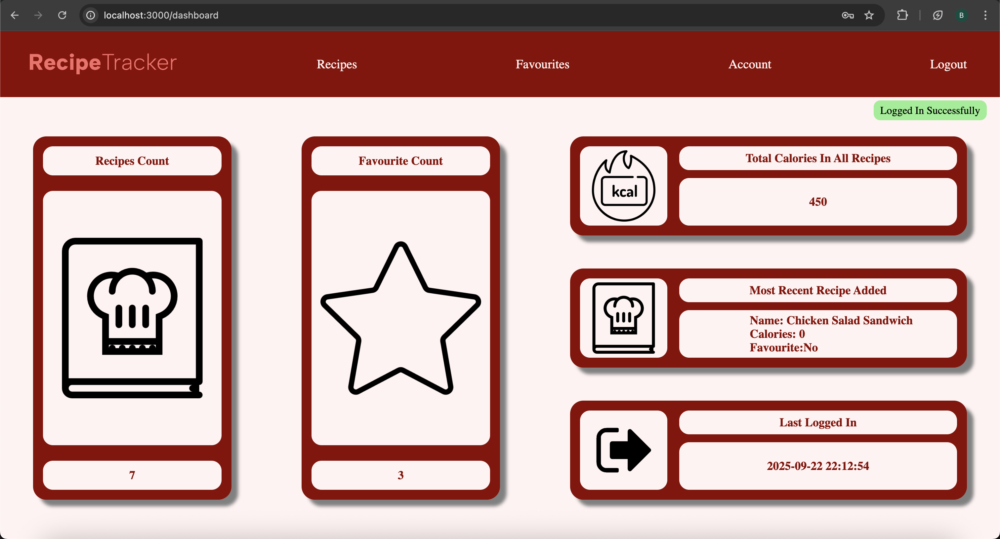
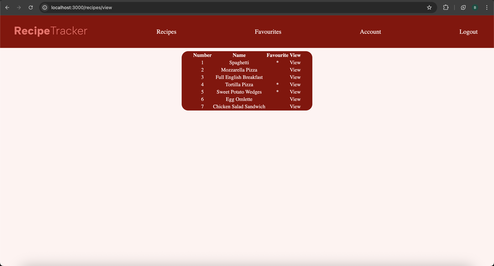
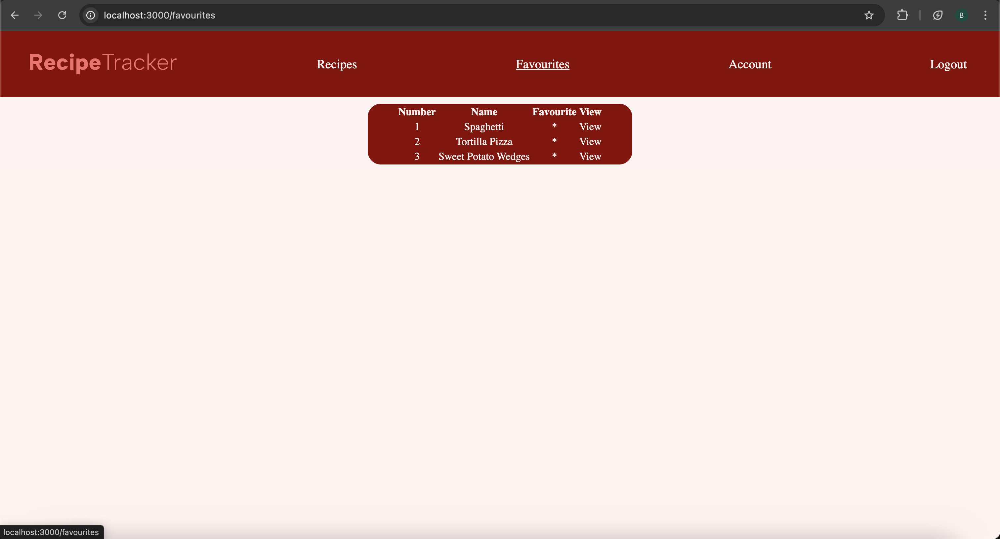
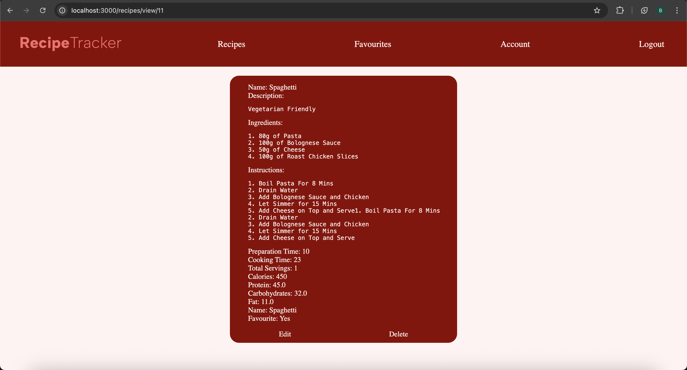
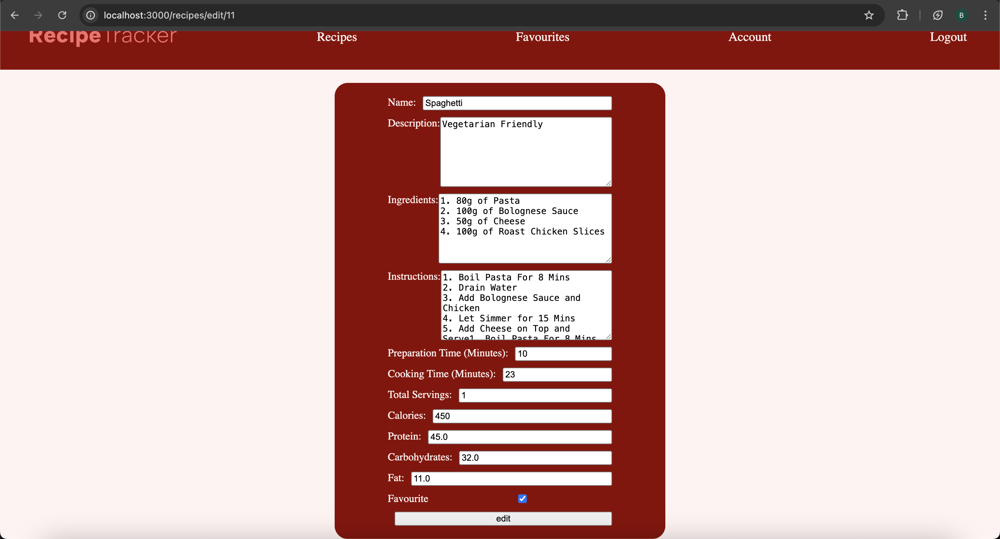
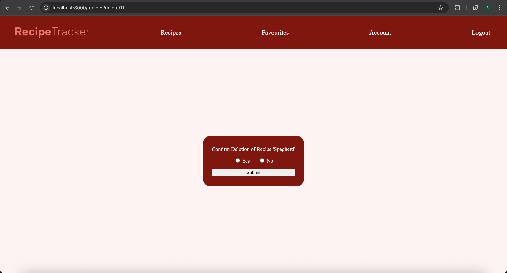

# Recipe Tracker
**Deployment Link:** https://recipe-tracker-zauo.onrender.com/

This project was inspired by my first year of university, where I experimented with different recipes trying to make them perfect. Tracking these recipes was a very forgetful task, it required additional effort writing everything out. For this problem, using independant learning and first year university, I designed a full-stack application that allows users to authenticate themselves, create, read, update and delete recipes effectively.

## Features

- User Authentication (Signup and Login/Logout)
- Password Encryption Through Hashing
- Create, Read, Update and Delete User Information
- Create, Read, Update and Delete Recipes
- Generalised and Specific Route Error Handling
- Environmental Variables for Database Configuration and Session Secret Key
- Express-Session used to Remember Logged-In Users
- Input Validation for Emails and Passwords
- Length Validation for All Other Fields of Input
- User Feedback for Actions Through Alerts

## Environmental Variables 

- SESSION_SECRET (String to Encrypt Sessions)
- DB_HOST (Host for Database)
- DB_USER (User for Database)
- DB_PASSWORD (Password for Database)
- DB_DATABASE (Database Name)
- PORT (Local Server Port Number)

## Local Deployment Setup
### Code Setup
1. git clone https://github.com/BavneetSingh07/database-project.git
2. 
```bash
npm install
```
3. create .env file (containing all variables listed above)

### Database Setup
1. Create Database
```sql
CREATE DATABASE recipe_tracker;
```
2. Create Tables (login, userInfo, recipes)
- login Table
```sql
CREATE TABLE `login` (
  `id` int unsigned NOT NULL AUTO_INCREMENT,
  `username` varchar(20) NOT NULL,
  `password` varchar(255) NOT NULL,
  `last_logged_in` datetime DEFAULT NULL,
  PRIMARY KEY (`id`),
  UNIQUE KEY `username_UNIQUE` (`username`)
);
```

- userInfo Table
```sql
CREATE TABLE `userInfo` (
  `id` int unsigned NOT NULL,
  `first_name` varchar(100) DEFAULT NULL,
  `last_name` varchar(100) DEFAULT NULL,
  `date_of_birth` date DEFAULT NULL,
  `email` varchar(100) DEFAULT NULL,
  `address` varchar(255) DEFAULT NULL,
  PRIMARY KEY (`id`),
  CONSTRAINT `userinfo_ibfk_1` FOREIGN KEY (`id`) REFERENCES `login` (`id`)
);
```

- recipes Table
```sql
CREATE TABLE `recipes` (
  `recipe_id` int unsigned NOT NULL AUTO_INCREMENT,
  `user_id` int unsigned DEFAULT NULL,
  `name` varchar(100) NOT NULL,
  `description` mediumtext,
  `ingredients` mediumtext,
  `instructions` mediumtext,
  `prep_time` int DEFAULT NULL,
  `cooking_time` int DEFAULT NULL,
  `total_servings` int DEFAULT NULL,
  `calories` int DEFAULT NULL,
  `protein` decimal(5,2) DEFAULT NULL,
  `carbohydrates` decimal(5,2) DEFAULT NULL,
  `fat` decimal(5,2) DEFAULT NULL,
  `favourite` tinyint(1) DEFAULT '0',
  PRIMARY KEY (`recipe_id`),
  KEY `recipes_ibfk_1` (`user_id`),
  CONSTRAINT `recipes_ibfk_1` FOREIGN KEY (`user_id`) REFERENCES `login` (`id`)
);
```
### Server Startup
**Run the following command in terminal**
```bash
node index.js
```
## Usage

1. Sign Up
Users can create an account if they're not signed up on the application 

2. Log In
Users can log into the application to access their recipes

3. View Recipes
Users can view their list of created recipes

4. Create Recipes
Users can create recipes by filling in the fields on the form and submitting

5. Update Recipes
Users can update their existing recipes by editing the fields and submitting

6. Delete Recipes
Users can delete recipes when they're no longer required

7. Update User Information
Users can update existing information about themselves

8. Delete Account
Users can delete their account from the database

9. Additional Features
- Users can view all the recipes they have favourited
- Users can change their password 

## Technologies

- HTML and CSS (For Front-end Development)
- Nodejs (For Backend JavaScript)
- Express (For App Route Management)
- EJS (For Designing Dynamic HTML Pages)
- MySQL (For Storing Data)
- Bcrypt (For Password Encryption)
- Express-Session (For User Authentication)

## Screenshots
### Sign Up and Login


### Dashboard/Recipe View/Favourites



### View/Edit/Delete Recipes




## Future Improvements

- Confirming Password
- Ratings For Recipes
- API Integration for Ingredients
- AI Integration with Auto-completing Fields For Recipes
- Search Functionality for Efficiency
- Responsive User Interface
